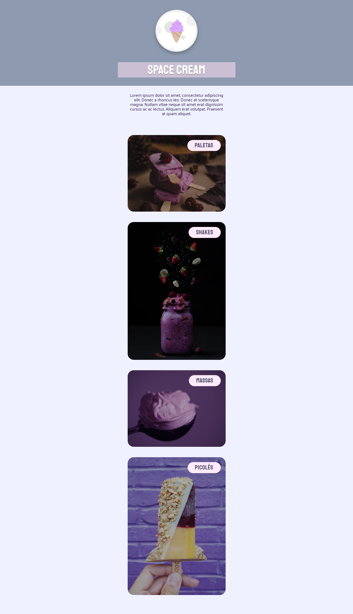

<h1 align="center">Space Cream (mobile-first)</h1>

## 📋 Descrição do projeto

Este <em>website</em> foi desenvolvido em <em>mobile first</em> com o intuito de fixar os novos conhecimentos em responsividade.

- O projeto foi desenvolvido durante o stage 03 da Trilha Explorer da <a href="https://www.rocketseat.com.br/">@Rocketseat</a>.

> HTML:
- Tags de texto;
- Tags semânticas;
- Tags de midias e seus atributos de acessibilidade;
- Classes e Ids.
 
> CSS:
- Variáveis;
- Pseudo-classes;
- Criação de novos elementos com <em><strong>CSS</strong></em>;
- Propriedades de posicionamento; 
- Modo de exibição dos elementos;
- Propriedades responsivas;
- Modelos de cursor;
- Transformações, animações e transições de elementos;
- Seletores e suas combinações;
- Propriedades de alinhamento e espaçamento;
- Filtros dos elementos;
- @keyframes.

> Protótipo:

🔗 [Clique aqui para acessar](https://nathxrz.github.io/TrilhaExplorer-projeto-5-mobile-first/)
 

## 🛠️ Tecnologias
- HTML
- CSS

## 📩 Contato
> 📧 nathyrezendemachado@gmail.com  
> 💼 <a href="https://www.linkedin.com/in/nathalia-machado-021b1b230/"> LinkedIn</a>  

    